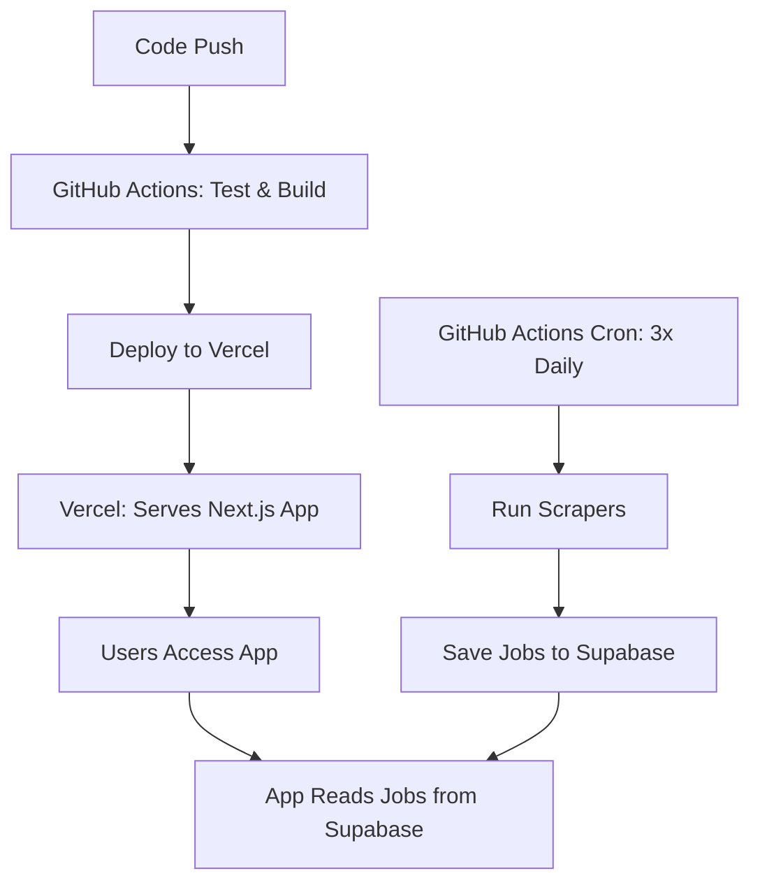

# 🚀 JobPing Deployment Architecture - Vercel + GitHub Actions

## ✅ Recommended Architecture: Vercel + GitHub Actions

### The Problem with Vercel for Job Scraping
- Vercel functions have 10-minute execution limit
- Your scrapers take 10+ minutes to run all sources
- **Solution**: Use GitHub Actions for scraping, Vercel for the app

## 🏗️ Architecture Overview

### Vercel (Primary - Application)
- **Hosts**: Your Next.js app (frontend + API routes)
- **Handles**: User dashboard, job matching, API endpoints
- **Perfect for**: Fast serverless functions, automatic deployments
- **Does NOT**: Run long job scraping processes

### GitHub Actions (Job Scraping)
- **Runs**: Your scrapers via scheduled workflows
- **Schedule**: 3x daily (8am, 1pm, 6pm UTC)
- **Uses**: Your existing `automation/real-job-runner.js`
- **Saves**: Directly to Supabase (same database as Vercel app)

### Railway (Disabled)
- **Status**: Remove Railway deployment
- **Reason**: Using Vercel instead

## 🔧 Implementation Steps

### 1. Set up Vercel Project

1. **Connect to GitHub**:
   - Go to [vercel.com](https://vercel.com)
   - Import your GitHub repository
   - Select "Next.js" framework

2. **Add Environment Variables** in Vercel Dashboard:
   ```bash
   NEXT_PUBLIC_SUPABASE_URL=your_supabase_url
   SUPABASE_SERVICE_ROLE_KEY=your_service_role_key
   OPENAI_API_KEY=your_openai_key
   RAPIDAPI_KEY=your_rapidapi_key
   ```

3. **Deploy**: Vercel will auto-deploy on push to main

### 2. Set up GitHub Actions Secrets

Go to your GitHub repo → Settings → Secrets and variables → Actions

Add these secrets:
```bash
# Database
NEXT_PUBLIC_SUPABASE_URL=your_supabase_url
SUPABASE_SERVICE_ROLE_KEY=your_service_role_key

# API Keys (add all your working keys)
RAPIDAPI_KEY=your_rapidapi_key
ADZUNA_APP_ID=your_adzuna_app_id
ADZUNA_APP_KEY=your_adzuna_app_key
REED_API_KEY=your_reed_api_key
MUSE_API_KEY=your_muse_api_key
JOOBLE_API_KEY=your_jooble_api_key
GREENHOUSE_API_KEY=your_greenhouse_api_key
SERP_API_KEY=your_serp_api_key

# OpenAI for job processing
OPENAI_API_KEY=your_openai_api_key

# Vercel deployment (optional)
VERCEL_TOKEN=your_vercel_token
VERCEL_ORG_ID=your_vercel_org_id
VERCEL_PROJECT_ID=your_vercel_project_id
```

### 3. Test the Setup

1. **Test Vercel Deployment**:
   ```bash
   git add .
   git commit -m "Add Vercel + GitHub Actions architecture"
   git push origin main
   ```
   - Check Vercel dashboard for successful deployment
   - Visit your app URL to verify it's working

2. **Test GitHub Actions Scraping**:
   - Go to GitHub repo → Actions tab
   - Click "JobPing Automated Scraping" workflow
   - Click "Run workflow" → "Run workflow" (manual trigger)
   - Monitor the logs for successful scraping

### 4. Monitor the System

#### Vercel Monitoring:
- **App Performance**: Vercel dashboard → Analytics
- **API Routes**: Vercel dashboard → Functions
- **Build Logs**: Vercel dashboard → Deployments

#### GitHub Actions Monitoring:
- **Scraping Logs**: GitHub repo → Actions tab
- **Success/Failure**: Email notifications (if configured)
- **Job Database**: Check Supabase for new jobs

#### Supabase Monitoring:
- **Job Data**: Supabase dashboard → Table Editor → jobs
- **Database Metrics**: Supabase dashboard → Reports
- **Real-time**: Supabase dashboard → Logs

## 🎯 New Workflow



## ✅ Benefits of This Architecture

- **Vercel Strengths**: Fast app deployment, automatic scaling, great Next.js integration
- **GitHub Actions Strengths**: No time limits, perfect for long-running scrapers
- **Clean Separation**: App logic vs. data collection
- **Cost Effective**: GitHub Actions generous free tier for cron jobs
- **Reliable**: If scraping fails, app still works (reads existing jobs)

## 🚀 Migration Steps

1. ✅ Set up Vercel project and connect to your GitHub repo
2. ✅ Add environment variables to Vercel dashboard
3. ✅ Add GitHub secrets for scraping
4. ✅ Update workflow files (completed above)
5. ✅ Test deploy - push to main branch
6. ⏳ Disable Railway deployment
7. ⏳ Monitor first scraping run in GitHub Actions

## 🔍 How to Monitor

### Vercel:
- App performance and API routes
- Real user metrics
- Build and deploy logs

### GitHub Actions:
- Scraping job logs
- Success/failure notifications
- Job database metrics

### Supabase:
- Job data and database metrics
- Real-time job insertion monitoring

## 🛠️ Troubleshooting

### Common Issues:

1. **Vercel Build Fails**:
   - Check environment variables are set
   - Verify `vercel.json` configuration
   - Check build logs in Vercel dashboard

2. **GitHub Actions Scraping Fails**:
   - Verify all secrets are set correctly
   - Check Python dependencies (JobSpy)
   - Review scraping logs for specific errors

3. **No Jobs Being Saved**:
   - Check Supabase connection in GitHub Actions
   - Verify API keys are valid
   - Check scraping logs for errors

### Debug Commands:

```bash
# Test scraping locally
node automation/real-job-runner.js --single-run

# Test Vercel build locally
npm run build

# Check environment variables
echo $NEXT_PUBLIC_SUPABASE_URL
```

## 📊 Expected Results

After successful setup:
- **Vercel**: App accessible at `https://your-app.vercel.app`
- **GitHub Actions**: Scraping runs 3x daily automatically
- **Supabase**: Jobs being saved with source breakdown
- **Users**: Can access job matching through the web app

## 🎉 Success Metrics

- ✅ Vercel app loads successfully
- ✅ GitHub Actions scraping completes without errors
- ✅ Jobs appear in Supabase database
- ✅ User can access job matching features
- ✅ Email system works with new job data
